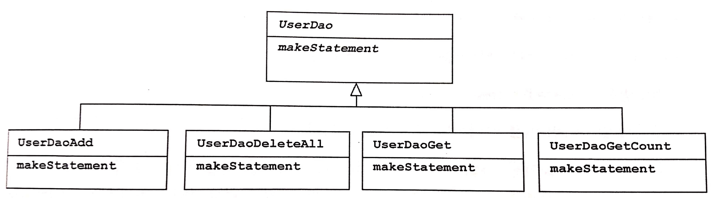
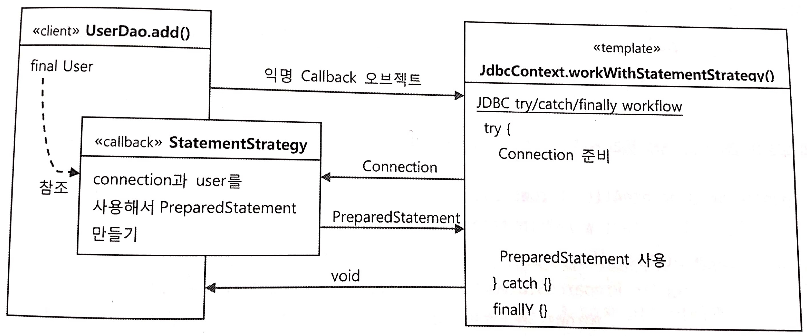
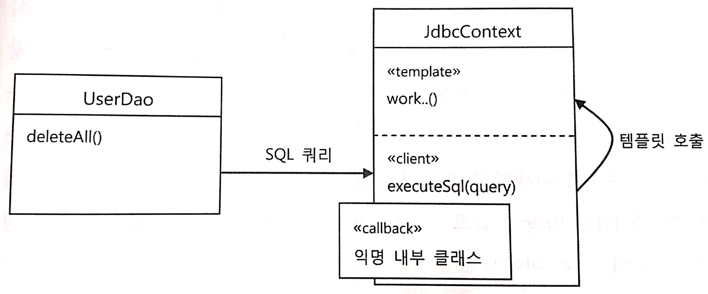

# 3장. 템플릿

- 템플릿이란? 변경이 거의 일어나지 않으며 일정한 패턴으로 유지되는 특성을 가진 부분을 자유롭게 변경되는 성질을 가진 부분으로부터 독립시켜서 효과적으로 활용하는 방법이다.

<br/>

## 3.1 다시 보는 초난감 DAO

- JDBC 코드에는 예외처리를 반드시 처리해야한다. 사용한 리소스를 반환하도록 만들지 않느면 시스템에 심각한 문제를 일으킬 수 있기 때문이다.

> **close()**
`Connection`이나 `PreparedStatement`에는 close() 메소드가 있다. 이는 리소스를 반환한다는 의미로 이해하는 것이 좋다. `Connection`과 `PreparedStatement`는 미리 정해진 풀 안에 제한된 수의 리소스를 만들어 두고 필요할 때 이를 할당하고, 반환하면 다시 풀에 넣는 방식으로 운영된다.
사용한 리소스가 빠르게 반환되지 않으면 풀에 있는 리소스가 고갈되고 문제가 발생한다. close() 메소드는 사용한 리소스를 풀로 다시 돌려주는 역할을 한다.

- 예외상황에서도 리소스를 제대로 반환할 수 있도록 try/catch/finally를 적용해야한다.

<br/>

## 3.2 변하는 것과 변하지 않는 것

#### try/catch/finally 코드의 문제점

- 해당 메소드가 호출되고 나면 커넥션이 하나씩 반환되지 않고 쌓여가게 된다. 서버에 배치해서 사용하면 언젠가 DB 풀에 설정해놓은 최대 DB 커넥션 개수를 넘어서고, 에러가 나면서 서비스가 중단되는 상황이 발생한다.

- 가독성이 매우 미흡하여 close() 메소드를 빼먹은 부분을 찾는데 오랜 시간이 걸린다.

<br/>

#### 해결방법1. 템플릿 메소드 패턴 적용



- 장점: UserDao 클래스의 기능을 확장하고 싶을 때마다 상속을 통해 자유롭게 확장할 수 있고, 확장 때문에 기존의 상위 DAO 클래스에 불필요한 변화는 생기지 않도록 할 수 있다.
- 단점: DAO 로직마다 상속을 통해 새로운 클래스를 만들어야 한다. 또 확장구조가 이미 클래스를 설계하는 시점에서 고정되어 유연성이 떠어진다.

<br/>


#### 해결방법2. 전략 패턴 적용


- 전략 패턴은 확장에 해당하는 변하는 부분을 별도의 클래스로 만들어 추상화된 인터페이스를 통해 위임하는 방식이다.

```java
public interface StatementStrategy{
  PreparedStatement makePreparedStatement(Connection c) throws SQLException;
}

public class DeleteAllStatement implements StatementStrategy{
  public PreparedStatement makePreparedStatement(Connection c) throws SQLException{
    PreparedStatement ps = c.preparedStatement("delete from users");
    return ps;
  }
}

public void deleteAll() throws SQLException{
  try{
    c = dataSource.getConnection();

    StatementStrategy strategy = new DeleteAllStatement();
    ps = strategy.makePreparedStatement(c);

    ps.executeUpdate();
  } catch (SQLException e){
    ...
  }
}
```

- 전략 패턴은 필요에 따라 컨텍스트는 그대로 유지되면서 전략을 바꿔 쓸 수 있다는 것인데, 이렇게 컨텍스트 안에서 이미 구체적인 전략 클래스인 `DeleteAllStatement`를 사용하도록 고정되어 있다는 점이 문제점이다.

<br/>

#### 해결방법3. DI 적용을 위한 클라이언트/컨텍스트 분리

- 이 컨텍스트에 해당하는 JDBC try/catch/finally 코드를 클라이언트 코드인 `StatementStrategy`를 만드는 부분에서 독립시켜야 한다.

```java
//변하지 않는 부분
public void jdbcContextWithStatementStrategy(StatementStrategy stmt) throws SQLException{
  Connection c = null;
  PreparedStatement ps = null;

  try {
    c = dataSource.getConnection();

    ps = stmt.makePreparedStatement(c);

    ps.executeUpdate();
  } catch (SQLException e){
    throw e;
  } finally {
    if (ps != null) { try {ps.close();} catch(SQLException e){}}
    if (c != null) { try {c.close();} catch(SQLException e){}}
  }
}

//변하는 부분
public void deleteAll() throws SQLException{
  StatementStrategy st = new DeleteAllStatement();
  jdbcContextWithStatementStrategy(st);
}
```

- 위의 구조가 완벽한 전략 패턴의 모습이다. 클라이언트가 컨텍스트가 사용할 전략을 정해서 전달하는 면에서 DI 구조라고 이해할 수도 있다.

> **마이크로 DI**
의존관계 주입(DI)는 제3자의 도움을 통해 두 오브젝트 사이의 유연한 관계가 설정되도록 만든다는 것이다.
DI가 매우 작은 다누이의 코드와 메소드 사이에서 일어나기도 한다. 이렇게 DI의 장점을 단순화해서 IoC 컨테이너의 도움 없이 코드 내에서 적용한 경우를 마이크로 DI라고도 한다. 또는 코드에 의한 DI라는 의미로 수동 DI라고 부를 수도 있다.

<br/>

## 3.3 JDBC 전략 패턴의 최적화

**문제점**
- 앞서 만들어진 코드는 DAO 메소드마다 새로운 `StatementStrategy` 구현 클래스를 만들어야 한다는 점이 문제이다. 이렇게 되면 클래스 파일의 개수가 많이 늘어나게 된다.
- DAO 메소드에 전달할 부가적인 정보가 있는 경우, 이를 위해 오브젝트를 전달받는 생성자와 이를 저장해둘 인스턴스 변수를 번거롭게 만들어야 한다는 점도 문제이다.

#### 개선방안1. 로컬 클래스

- 클래스 파일이 많아지는 문제는 `StatementStrategy` 전략 클래스를 매번 독립된 파일로 만들지 않고 UserDao 클래스 안에 내부 클래스로 정의하는 것이다.

> **중첩 클래스의 종류**
다른 클래스 내부에 정의되는 클래스를 중첩 클래스라고 한다. 중첩 클래스는 독립적으로 오브젝트로 만들어질 수 있는 static 클래스와 자신이 정의된 클래스의 오브제그 안에서만 만들어질 수 있는 내부 클래스로 구분된다.
내부 클래스는 오브젝트 레벨에서 정의되는 멤버 내부 클래스와 메소드 레벨에 정의되는 로컬 클래스, 이름을 갖지 않는 익명내부 클래스로 구분된다.

- 장점: 클래스가 내부 클래스이기 때문에 자신이 선언된 곳의 정보에 접근할 수 있다. 또 정보를 전달받기 위해 만들어야 하는 생성자와 인스턴스 변수를 제거할 수 있다.

<br/>

#### 개선방안2. 익명 내부 클래스

> **익명 내부 클래스**
 익명 내부 클래스는 이름을 갖지 않는 클래스로 클래스를 재사용할 필요가 없고, 구현한 인터페이스 타입으로만 사용할 경우에 유용하다.
ex) new 인터페이스이름() { 클래스 본문 };

- 익명 내부 클래스로 만들게 되면 간결하게 코드가 바뀌며 클래스 이름도 제거할 수 있다.

다음은 deleteAll() 메소드를 익명 내부 클래스로 구현한 코드이다.

```java
public void deleteAll() throws SQLException{
  jdbcContextWithStatementStrategy(
    // 익명 내부 클래스로 구현
    new StatementStrategy() {
      public PreparedStatement makePreparedStatement(Connection c) throws SQLException{
        return c.preparedStatement("delete from users");
      }
    }
  );
}
```

<br/>

## 3.4 컨텍스트와 DI

- 전략 패턴의 구조로 보자면 `UserDao`의 메소드가 클라이언트이고 익명 내부 클래스로 만들어지는 것이 개별적인 전략이고, jdbcContextWithStatementStrategy() 메소드는 컨텍스트이다.
- jdbcContextWithStatementStrategy() 메소드는 **다른 DAO에서도 사용 가능**하기 때문에 UserDao 클래스 밖으로 독립시켜 모든 DAO가 사용할 수 있도록 만들어본다.

```java
public class JdbcContext{
  private DataSource dataSource;
  //DataSource 타입 빈을 DI 받을 수 있게 준비한다.
  public void setDataSource(DataSource dataSource){
    this.dataSource = dataSource;
  }

  public void workwithStatementStrategy(StatementStrategy stmt) throws SQLException{
    Connection c = null;
    PreparedStatement ps = null;

    try{
      c = this.dataSource.getConnection();

      ps = stmt.makePreparedStatement(c);

      ps.executeUpdate();
    } catch (SQLException e) {
      throw e;
    } finally {
      if (ps != null) { try {ps.close();} catch(SQLException e){}}
      if (c != null) { try {c.close();} catch(SQLException e){}}
    }
  }
}

public class UserDao{
  ...
  private JdbcContext jdbcContext;

  public void setJdbcContext(JdbcContext jdbcContext){
    this.jdbcContext = jdbcContext;
  }

  public void deleteAll() throws SQLException{
    this.jdbcContext.workwithStatementStrategy(
      new StatementStrategy() {
        public PreparedStatement makePreparedStatement(Connection c) throws SQLException{
          return c.preparedStatement("delete from users");
        }
      }
    );
  }
}
```

<br/>

#### 인터페이스를 사용하지 않고 DAO와 밀접한 관계를 갖는 클래스를 DI에 적용하는 방법 두가지

**1. 스프링의 DI를 이용하기 위해 빈으로 등록해서 사용하는 방법**

- 인터페이스를 사용하지 않고 DI를 적용하는 것은 문제가 있지 않을까?
=> 의존관계 주입(DI) 개념에 따르면 인터페이스를 사이에 둬서 의존관계가 고정되지 않게 하는게 맞지만, **스프링 DI는 객체의 생성과 관계설정에 대한 제어권한을 오브젝트에서 제거하고 외부로 위임했다는 IoC의 개념을 포괄한다.**
=> 인터페이스가 없다는 건 `UserDao`와 `JdbcContext`가 매우 긴밀한 관계를 가지고 강하게 결합되어 있다는 의미이다. **이 둘은 강한 응집도를 갖고 있으며 다른 구현으로 대체해서 사용할 이유가 없기 때문에 인터페이스를 굳이 둘 필요가 없다.**

<br/>

- DI 구조로 만들어야 하는 이유는 뭘까?
1. `JdbcContext`가 스프링 컨테이너의 싱글톤 레지스트리에서 관리되는 **싱글톤 빈**이 되기 때문이다.
2. `JdbcContext`가 DI를 통해 **다른 빈에 의존**하고 있기 때문이다 => DI를 위해서는 주입되는 오브젝트와 주입받는 오브젝트 양쪽 모두 스프링 빈으로 등록돼야 한다. 스프링이 생성하고 관리하는 IoC 대상이어야 DI에 참여할 수 있다.

<br/>

- 장점: 의존관계가 설정파일에 명확하게 드러난다는 장점이 있다.
- 단점: DI의 근본적인 원칙에 부합하지 않는 구체적인 클래스와의 관계가 설정에 직접 노출된다.

**2. DAO의 코드를 이용해 수동으로 DI하는 방법**

- DAO 내부에 직접 DI를 적용해서 DAO마다 하나의 `JdbcContext` 오브젝트를 갖고 있게 하는 것이다.
- 스프링 설정파일에 `UserDao`와 `DataSource` 두개만 빈으로 정의한다.

- 장점: 관계를 외부에 드러내지 않기 때문에 필요에 따라 내부에서 은밀히 DI를 수행하고 그 전략을 외부에는 감출 수 있다.
- 단점: 싱글톤으로 만들 수 없고, DI 작업을 위한 부가적인 코드가 필요하다는 단점이 있다.

<br/>

## 3.4 템플릿과 콜백

- 템플릿/콜백 패턴: 복잡하지만 바뀌지 않는 일정한 패턴을 갖는 작업 흐름이 존재하고 그중 일부분만 자주 바꿔서 사용해야 하는 경우에 적합한 구조이다. **전략 패턴의 기본 구조에 익명 내부 클래스를 활용한 방식이다.** 전략 패턴의 Context를 템플릿이라 부르고, 익명 내부 클래스로 만들어지는 오브젝트를 콜백이라고 부른다.

> **템플릿**
템플릿은 어떤 목적을 위해 미리 만들어둔 모양이 있는 틀을 가리킨다. 템플릿 메소드 패턴은 고정된 틀의 로직을 가진 템플릿 메소드를 슈퍼클래스에 두고, 바뀌는 부분을 서브클래스의 메소드에 두는 구조로 이뤄진다.

> **콜백**
콜백은 실행되는 것을 목적으로 다른 오브젝트의 메소드에 전달되는 오브젝트를 말한다. 자바에선 메소드 자체를 파라미터로 전달할 방법은 없기 때문에 메소드가 담긴 오브젝트를 전달해야 한다.

<br/>

#### 템플릿/콜백의 동작원리

- 템플릿/콜백 패턴의 콜백은 보통 단일 메소드 인터페이스를 사용한다. 콜백은 일반적으로 하나의 메소드를 가진 인터페이스를 구현한 익명 내부 클래스로 만들어진다.



1. UserDao가 템플릿 메소드(workwithStatementStrategy)를 호출하면서 `Callback` 오브젝트를 전달한다.
2. `JdbcContext`는 정해진 작업 흐름을 따라 작업을 진행하다가 내부에서 생성한 참조정보를 가지고 `Callback` 오브젝트의 메소드를 호출한다. `Callback`은 `UserDao` 메소드에 있는 정보와 `JdbcContext`가 제공한 참조정보를 이용해 작업을 수행하고 그 결과를 돌려준다.
3. `JdbcContext`는 `Callback`이 돌려준 정보를 사용해 작업을 마저 수행하고 경우에 따라 최종 결과를 다시 돌려준다.

<br/>

#### 편리한 콜백의 재활용

- 템플릿/콜백 방식은 익명 내부 클래스를 사용하기 때문에 상대적으로 코드를 작성하고 읽기가 조금 불편하다는 점이 있다.

- 복잡한 익명 내부 클래스의 사용을 최소화하는 방법으로 메소드를 분리하고 모든 DAO가 공유할 수 있도록 템플릿 클래스 안으로 옮긴다.

```java
// 변하는 sql 문장은 Dao 클래스에 둔다.
public class UserDao{
  ...
  public void deleteAll() throws SQLException{
    executeSql("delete from users");
  }
}

// 변하지 않는 부분을 재사용하도록 JdbcContext로 옮긴다.
public class JdbcContext{
  ...
  public void executeSql(final String query) throws SQLException{
    this.jdbcContext.workwithStatementStrategy(
      new StatementStrategy() {
        public PreparedStatement makePreparedStatement(Connection c) throws SQLException{
          return c.preparedStatement(query);
        }
      }
    );
  }
}

```



- 하나의 목적을 위해 서로 긴밀하게 연관되어 동작하는 응집력이 강한 코드들은 한 군데 모여있는게 유리하다. 구체적인 구현과 내부의 전략 패턴, 코드에 의한 DI, 익명 클래스 등의 기술은 최대한 감춰두고, 외부에는 꼭 필요한 기능을 제공하는 단순한 메소드만 노출해 주는 것이다.

<br/>

## 3.6 스프링의 JdbcTemplate

- 스프링에서 제공하는 JDBC 코드용 기본 템플릿은 `JdbcTemplate`이다. 이 템플릿의 메소드를 요약한 것은 다음과 같다.

1. update() : `PreparedStatementCreator` 타입의 콜백을 받아서 사용하는 메소드이다. `PreparedStatementCreator` 콜백은 템플릿으로부터 `Connection`을 받고 `PreparedStatement`를 돌려준다. update()는 insert와 delete, update 쿼리에 사용할 수 있으며 `PreparedStatement`를 만드는 SQL과 동일하게 작성하며 바인딩할 파라미터는 순서대로 넣어주면 된다.
2. query() - 하나의 행 값을 받을 경우 : `PreparedStatementCreator` 콜백과 `ResultSetExtractor` 콜백을 파라미터로 받는 메소드이다. `ResultSetExtractor`는 `PreparedStatement`의 쿼리를 실행해서 얻은 `ResultSet`을 전달받는 콜백이다. `ResultSet`을 이용해 원하는 값을 추출해서 템플릿에 전달하면, 템플릿은 나머지 작업을 수행한 뒤에 그 값을 query() 메소드의 리턴 값으로 돌려준다.
3. queryForObject() : 이 메소드는 단순한 값이 아니라 복잡한 오브젝트로 만드는 작업을 수행한다. `ResultSet`의 결과를 오브젝트로 만들어 프로퍼티에 넣어줘야 한다. 파라미터로 SQL문과 Object 타입의 배열, `RowMapper` 콜백을 받는다. `RowMapper`에서는 `ResultSe`t이 가리키는 행의 내용을 오브젝트에 담아서 리턴해준다.
4. query() - 여러 행 값을 받을 경우 : 다수의 행을 리턴할 상황이 있을 때 사용하는 메소드이다. 여기서는 `ResultSetExtractor`가 아닌 `RowMapper` 콜백을 호출하여 오브젝트에 매핑하여 돌려준다.

<br/>

## 3.7 정리

- JDBC와 같은 예외가 발생할 가능성이 있으며 공유 리소스의 반환이 필요한 코드는 반드시 try/catch/finally 블록으로 관리해야 한다.
- 일정한 작업 흐름이 반복되면서 그중 일부 기능만 바뀌는 코드가 존재한다면 전략 패턴을 적용한다. 바뀌지 않는 부분은 컨텍스트로, 바뀌는 부분은 전략으로 만들고 인터페이스를 통해 유연하게 전략을 변경할 수 있도록 구성한다.
- 같은 애플리케이션 안에서 여러 가지 종류의 전략을 다이내믹하게 구서아고 사용해야 한다면 컨텍스트를 이용하는 클라이언트 메소드에서 직접 전략을 정의하고 제공하게 만든다.
- 클라이언트 메소드 안에 익명 내부 클래스를 사용해서 전략 오브젝트를 구현하면 코드도 간결해지고 메소드의 정보를 직접 사용할 수 있어서 편리하다.
- 컨텍스트가 하나 이상의 클라이언트 오브젝트에서 사용된다면 클래스를 분리해서 공유하도록 만든다.
- 컨텍스트는 별도의 빈으로 등록해서 DI 받거나 클라이언트 클래스에서 직접 생성해서 사용한다.
- 단일 전략 메소드를 갖는 전략 패턴이면서 익명 내부 클래스를 사용해서 매번 전략을 만들어 사용하고, 컨텍스트 호출과 동시에 전략 DI를 수행하는 방식을 템플릿/콜백 패턴이라고 한다.
- 콜백의 코드에도 일정한 패턴이 반복된다면 콜백을 템플릿에 넣고 재활용하는 것이 편리하다.
- 템플릿과 콜백의 타입이 다양하게 바뀔 수 있다면 제네릭스를 이용한다.
- 스프링은 JDBC 코드 작성을 위해 `JdbcTemplate`을 기반으로 하는 다양한 템플릿과 콜백을 제공한다.
- 템플릿은 한 번에 하나 이상의 콜백을 사용할 수도 있고, 하나의 콜백을 여러 번 호출할 수도 있다.
- 템플릿/콜백을 설계할 때는 템플릿과 콜백 사이에 주고받는 정보에 관심을 둬야 한다.
