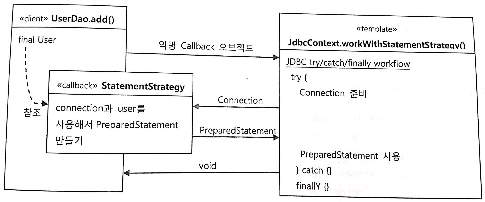

## 서비스 추상화

#### 5.1 사용자 레벨관리 기능 추가

&#10004; 목표: 지금까지 만든 DAO에 트랜잭션 적용해보면서 스프링이 어떻게 성격이 비슷한 여러 종류의 기술을 추상화하고 이를 **일관된 방법**으로 사용할 수 있도록 지원하는지를 알기


지금까지의 Dao는 가장 기초적인 방법만 가능하다 (어떤 비즈니스 로직도 갖고 있지 않다)

이제부터는 비즈니스 로직도 구현해 보자


적용 : 사용자 레벨 관리 기능 추가 비즈니스 , 사용자 관리의 기본 로직은 정해진 조건에 따라 사용자의 레벨을 주기적으로 변경한다는 것이다.

##### 필드추가

숫자 타입을 직접 사용하는 것보다는 enum을 사용하는 게 안전하고 편리하다.

```

public enum Level{

  BASIC(1),SILVER(2),GOLD(3);

  private final int value;

  Level(int value){
      this.value = value;
  }

  public int intValue(){
    return value;
  }

  public static Level valueOf(int value){
    switch(value){
      case 1: return BASIC;
      case 2: return SILVER;
      case 3: return GOLD;
      default : throw new AssertionError("unKnown value: "+ value);
    }

  }

}

```

User 필드에 위에 만든 level 추가

UserDaoTest 테스트 수정
User 클래스 생성자의 파라미터를 추가해준다

##### checkSameUser() 메소드 수정

```
private void checkSameUser(User user1,User user2){
  assertThat(user1.getId(), is(user2.getId());
     ... 생략

  assertThat(user1.getLevel(), is(user2.getLevel());
  assertThat(user1.getLogin(), is(user2.getLogin());  
  assertThat(user1.getRecommend(), is(user2.getRecommend());

}

```
여기까지 하면 테스트는 준비된 것이다.

이제 테스트 대상인 UserDaoJdbc 수정하고 사용자 수정 기능까지 추가해보자

##### update() 메소드 추가
```
public interface UserDao{
  ...
  public void update(User user1){

  }
}
```
```
public void update(User user){
  this.jdbcTemplate.update(
      "update users set name =?, password=?, level=?,login=?,"+
      "recommend = ? where id = ?", user.getName(),user.getPassword(),user.getLevel().intValue(),
      user.getLogin(),user.getRecommend(), user.getId();
    )
}
```


##### 여기까지 작업을 끝낸 후의 문제점

JDBC 개발에서 리소스 반환과 같은 기본 작업을 제외하면 가장 많은 실수가 일어나는 곳은 바로 SQL 문장이다. 테스트로 검증하지 못하는 오류가 있을 수 있다. ex) update 문장에서 where 절을 빼먹는 경우 이러한 경우에는 수정하지 않아야 할 row의 내용이 그대로 남아 있는지 확인이 불가능 하다

##### 해결책

1. jdbcTemplate 의 update()가 돌려주는 리턴 값을 확인(영향 받은 로우의 개수)
2. 테스를 보강해서 원하는 사용자 외의 정보는 변경되지 않았음을 직접 확인


사용자 관리 로직은 UserDaoJdbc는 적당하지 않고 따로 로직을 담을 클래스를 하나 추가하는게 좋다. 이를 UserService라고 명한다. UserService는 인터페이스 타입으로 userDao 빈을 DI 받아 사용하게 만든다.

의존관계는 다음과 같다

<br/>


<br/>

##### UserServiceTest 테스트 클래스
UserServiceTest 클래스를 추가하고 테스트 대상이 UserService 빈을 제공받을 수 있도록 @Autowired가 붙은 인스턴스 변수로 선언해준다. 이를 통해 컨테이너가 관리하는 스프링 빈에 한해서 스프링 테스트 컨텍스트를 주입받을 수 있다,

##### upgradeLevels() 메소드와 테스트

로직
```
public void upgradeLevels(){
  List<User> users = userDao.getAll();
  for(User user: users){
    Boolean changed = null;
    if(user.getLevel()== Level.BASIC && user.getLogin() >= 50){
      user.setLevel(Level.SILVER);
      changed = true;
    }
    else if(user.getLevel() == Level.SILVER && user.getRecommend() >= 30){
      user.setLevel(Level.GOLD);
      changed = true;
    }
    else if(user.getLevel() == Level.GOLD) {changed = false;}
    else{changed = false;}
    if(changed ){userDao.update(user);}
  }

}
```

테스트

```
private void checkLevel(User user, Level expectedLevel){
  User userUpdate = userDao.get(user.getId());
  assertThat(userUpdate.getLevel(), isexpectedLevel);
}
```
##### upgradeLevels() 리팩토링
upgradeLevels 메소드 로직은 if/elseif/else 블록들이 읽기 불편하고 레벨의 변화 단계와 업그레이드 조건, 조건이 충족됐을 때 해야 할 작업들이 한데 섞여 있어서 로직을 이해하는데 쉽지 않다 또한 이런 if 조건 블록이 레벨 개수만큼 반복된다
만약 새로운 레벨이 추가된다면 Level 이늄도 수정해야하고 if 조건식와 블록을 추가해줘야한다.
이렇게 주어진 비즈니스 로직을 잘 처리하는 코드인 듯 보이지만 곰곰이 따져보면 refactoring이 필요하다는 것을 알 수 있다.


&#10004; 방법
기본 작업 흐름만 남겨두고 각각의 작업들은 따로 밖에서 처리한다
```
  public void upgradeLevels(){
    //굉장히 간단명료하게 바뀐걸 볼 수 있다.
    List<User> users = userDao.getAll();
    for(User user : users){
      if(CanUpgradeLevel(user)){
          upgradeLevel(user);
      }
    }    
  }

```


리팩토링으로 개선한 코드를 살펴보면 각 오브젝트와 메소드가 각각 자기 몫의 책임을 맡아 일을 하는 구조로 만들어졌음을 알 수 있다.
각자 자기 책임에 충실한 작업만 하고 있으니 코드를 이해하기도 쉽다.

#### 5.2 트랜잭션 서비스 추상화


정기 사용자 레벨 관리 작업을 수행하는 도중에 네트워크가 끊기거나 서버에 장애가 생겨서 작업을 완료할 수 없다면 그때까지 변경된 사용자의 레벨은 그대로 두는걸까? 아니면 모두 초기 상태로 되돌려 놓아야 할까?

작업 중간에 예외를 강제로 만들어 확인해 보자
* 테스트를 위해 코드를 함부로 건들이는 것 보다 테스트용으로 특별히 클래스를 만들어 사용하는 방법이 좋다. 간단히 UserService를 상속해서 오버라이딩
* 이때 다른 예외가 발생했을 경우와 구분하기 위해 static class 으로 정의한다.

지금까지 구현한 사용자 레벨 관리 기능은 예외가 발생해도 그 전까지 변경된 사용자 레벨은 그대로 적용되는 것을 확인할 수 있다

&#10004; 원인 : 모든 사용자의 레벨을 업그레이드하는 작업인 upgradeLevels() 메소드가 하나의 트랜잭션 안에서 동작하지 않았기 때문

##### JDBC 트랜잭션의 트랜잭션 경계설정

* JDBC의 트랜잭션은 하나의 Connection을 가져와 사용하다가 닫는 사이에서 일어난다. 트랜잭션의 시작과 종료는 Connection 오브젝트를 통해 이뤄지기 때문이다.
* JDBC에서 트랜잭션을 시작하려면 자동커밋옵션을 false로 만들어주면 된다. 기본설정은 DB작업을 수행한 직후에 자동으로 커밋이 되도록 되어있다.

이렇게 setAutoCommit(false)로 트랜잭션의 시작을 선언 후 commit() 또는 rollback()으로 트랜잭션을 종료하는 작업을 **트랜잭션의 경계설정** 이라고 한다


지금까지의 코드에서는 데이트 액세스 코드를 DAO로 만들어서 분리해놓았으므로 DAO 메소드를 호출할 때마다 하나의 새로운 트랜잭션이 만들어지는 구조가 될 수 밖에 없다.

##### 해결책

UserService 와 UserDao 를 그대로 둔 채로 트랜잭션을 적용하려면 결국 트랜잭션의 경계설정 작업을 UserService쪽으로 가져와야 한다.
<br/>

<br/>

하지만 이런식으로 수정하면 트랜잭션 문제는 해결할 수 있겠지만 여러가지 문제점이 존재

1. DB 커넥션을 비롯한 리소스의 깔끔한 처리를 가능하게 했던 jdbcTemplate을 더이상 사용하지 못함
2. DAO의 메소드와 비즈니스 로직을 담고 있는 UserService의 메소드에 Connection 파라미터가 추가돼야 한다는 점
3. Conntection 파라미터가 UserDao 인터페이스 메소드에 추가되면 UserDao는 더 이상 데이터 액세스 기술에 독립적일 수 가 없다는 점


###### 트랜잭션 동기화

&#10004; 스프링은 이러한 문제를 해결해 준다

트랜잭션 동기화란?

* UserService에서 트랜잭션을 시작하기 위해 만든 Connection 오브젝트를 특별한 저장소에 보관해두고, 이후에 호출되는 DAO의 메소드에서는 저장된 Connection을 가져다가 사용하게 하는 것이다. 정확히는 DAO가 사용하는 JdbcTemplate이 트랜잭션 동기화 방식을 이용하도록 하는 것이다.

* 트랜잭션 동기화 저장소는 작업 스레드마다 독립적으로 Connection 오브젝트를 저장하고 관리하기 때문에 다중 사용자를 처리하는 서버의 멀티스레드 환경에서도 충돌이 날 염려는 없다

이렇게 트랜잭션 동기화 기법을 사용하면 파라미터를 통해 일일이 Connection 오브젝트를 전달할 필요가 없어진다.


트랜잭션 동기화 방식을 적용한 UserService
```
public void upgradeLevelS() throws Exception{
  TransactionSynchronizationManager.initSynchronization();
  Connection c = DataSourceutils.getConnection(dataSource);
  c.setAutoCommit(false);

  try{
    List<User> users = userDao.getAll();
    for(User user: users){
      if(canUpgradeLevel(user)){
        upgradeLevel(user);
      }
    }
    c.commit();
  } catch(Exception e){
    c.rollback();
    throw e;

  }finally{
    DataSourceutils.releaseConnection(c, dataSource);
    TransactionSynchronizationManager.unbindResource(this.dataSource);
    TransactionSynchronizationManager.clearSynchronization();
  }
}

```


##### jdbcTemplate과 트랜잭션 동기화

jdbcTemplate는 영리하게 동작함

1. 미리 생성돼서 트랜잭션 동기화 저장소에 등록된 DB  커넥션이나 트랜잭션이 없는 경우
  -> jdbcTemplat이 직접 DB 커넥션을 만들고 트랜잭션을 시작해서 JDBC 작업을 진행

2. upgradeLevels() 메소드에서처럼 트랜잭션 동기화를 시작해 놓았을 경우
  -> 직접  DB 커넥션을 만드는 대신 트랜잭션 동기화 저장소에 들어있는 DB 커넥션을 가져와서 사용한다

비즈니스 로직 레벨의 트랜잭셕을 적용했지만 JdbcTemplate을 포기할 필요도 없고, 지저분한 Connection 파라미터를 계속 물고 다니지 않아도 된다.

##### 트랜잭션 서비스 추상화

만약 고객사가 여러개의 DB를 사용하고 있다 그래서 하나의 트랜잭션 안에서 여러 개의 DB에 데이터를 넣는 작업을 해야 할 필요가 발생했다.
이런 경우는 별도의 트랜잭션 관리자를 통해 트랜잭션을 관리하는 **글로벌 트랜잭션 방식** 을 사용해야 한다.

하나 이상의 DB가 참여하는 트랜잭션을 만들려면 **JTA**를 사용해야 한다


```
JTA를 이용한 트랜잭션 코드 구조

InitialContext ctx = new InitialContext();
UserTransaction tx = (UserTransaction)ctx.lookup(USER_TX_JNDI_NAME);

tx.begin();
Connection c = dataSource.getConnection();

try{
  // 데이터 액세스 코드
  tx.commit();
}catch(Exception e){
  tx.rollback();
  throw e;
}finally{
  c.close();
}

```

하지만 UserService 코드가 바껴야 하는 단점이 있다. 그렇다면 트랜잭션 처리 코드에도 추상화를 도입해볼 수 있지 않을까?

&#10004; 스프링은 트랜잭션 기술의 공통점을 담은 트랜잭션 추상화 기술을 제공하고 있다

<br><br>


