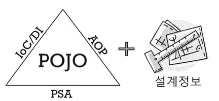
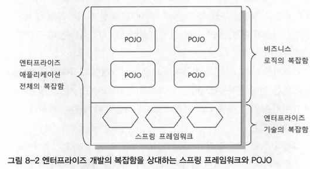

#8장. 스프링이란 무엇인가?
## 목표

1. 스프링이란 무엇이고 어떻게 설명할 수 있을까?
2. 스프링 프레임워크가 만들어진 이유와 존재 목적, 추가하는 가치는 무엇일까?

## 스프링의 정의

**
자바 엔터프라이즈 개발을 편하게 해주는 오픈소스 경량급 애플리케이션 프레임 워크
**

 

#### 애플리케이션 프레임워크

- 애플리케이션 프레임워크는 특정 계층이나 기술, 업무 분야에 국한되지 않고 애플리케이션의 전 영역을 포괄하는 범용적인 프레임워크를 말한다.

 

&#9989; **탄생배경**

스프링을 처음 만든 로드 존슨(Rod Johnson)은 [Expert One-on-One J2EE Design and Development]라는 책을 출간했다.

&#10148; 일부 개발자는 책에 나오는 프레임워크를 단지 예제 수준으로 두기에는 아깝다는 생각을 했고, 그것을 발전시켜서 지속적으로 개발하자는 의견을 냈다.

&#10148; 정식으로 스프링 프레임워크라는 이름의 오픈소스 프로젝트가 시작돼서 오늘날에 이르렀다.

 

- 스프링의 기원이 된 예제 애플리케이션의 프레임워크는 책에서 설명한 각종 자바 엔터프라이즈 개발 전략의 핵심을 담아서 개발됐다.
- 애플리케이션 프레임워크는 애플리케이션의 전 영역을 관통하는 일관된 프로그래밍 모델과 핵심 기술을 바탕으로 해서 각 분야의 특성에 맞는 필요를 채워주고 있다.
- 스프링의 일차적인 존재 목적은 핵심 기술에 담긴 프로그래밍 모델을 일관되게 적용해서 엔터프라이즈 애플리케이션 전 계층과 전 영역에 전략과 기능을 제공해줌으로써 편리하게 개발하게 해주는 것이다.

 

#### 경량급

&#9989; 스프링이 가볍다고 하는 이유는 무엇일까?

&#10148; 불필요하게 무겁지 않다는 의미이다.

&#10148; 과거 EJB는 코드 모두를 매우 무겁고 복잡하게 만들었다.

- **경량급**이라는 의미는 스프링을 기반으로 제작되는 코드가 기존 EJB나 여타 프레임워크에서 동작하기 위해 만들어진 코드에 비해 **상대적으로 작고 단순하다는 뜻**이기도 하다.
- 반복되던 코드가 제거되고 가장 단순하고 가벼운 코드만 남게 되었다.

 

#### 자바 엔터프라이즈 개발을 편하게

- 스프링은 근본적인 부분에서 엔터프라이즈 개발의 복잡함을 제거해내고 진정으로 개발을 편하게 해주는 해결책을 제시한다.
- 엔터프라이즈 개발의 근복적인 문제점에 도전해서 해결책을 제시한다는 것이 기존 기술의 접근 방법과 스프링의 접근 방법의 차이점이다.
- **편리한 애플리케이션 개발**이란 개발자가 복잡하고 실수하기 쉬운 로우레벨 기술에 많은 신경을 쓰지 않으면서도 애플리케이션의 핵심인 사용자의 요구사항, 즉 **비즈니스 로직을 빠르고 효과적으로 구현하는 것을 말한다.**

 

#### 오픈소스

- 스프링은 오픈소스 프로젝트 방식으로 개발돼왔다.

> **오픈소스**
오픈소스란 말 그대로 소스가 모두에게 공개되고, 특별한 라이선스를 취득할 필요없이 얼마든지 가져다 자유롭게 이용해도 된다는 뜻이다. 물론 오픈소스도 저작권이 있기 때문에 원 저작자에 대한 정보와 라이선스는 유지한 채로 사용하거나 배포해야지, 자신이 만든 것처럼 슬며시 가져다 사용해도 좋다는 뜻은 아니다.

**장점**

- 공개된 커뮤니티의 공간 안에서 투명한 방식으로 다양한 참여를 통해 개발되기 때문에 매우 빠르고 유연한 개발이 가능하다는 것이다.
- 오픈소스 사용자는 소스코드를 다운받아서 품질과 기능을 얼마든지 검증하고 분석해 볼 수 있다.
- 개발 중인 경우에도 소스코드까지 투명하게 공개되기 때문에 사용자의 피드백이 그만큼 빨리 전달되고 반영된다.
- 잠재적인 버그와 문제점이 빠르게 발견되고 해결될 수 있다.
- 라이선스 비용에 대한 부담이 없다.

**단점**

- 수익이 나지 않고 여가시간에 개발이 된다.
- 지속적이고 안정적인 개발이 진행되지 못한다.
- 엔터프라이즈 시스템 개발자는 언제 개발이 중단되거나 지연될지 모르는 오픈소스 프레임워크의 도입을 부정적으로 생각할 수 밖에 없다.

**단점극복**

- 스프링을 개발하고 있는 스프링소스는 스프링에 대한 전문적인 기술지원과 컨설팅 그리고 스프링을 기반으로 개발된 시스템을 안정적으로 운용할 수 있도록 돕는 상용 제품을 제공함으로써 수익을 얻고, 한편으로는 오픈소스 프로젝트로서 스프링이 효율적으로 개발되도록 지원하고 있다.
- 사용자는 개발이 중단될까봐 염려하지 않아도 되고, 필요한 경우에는 비용을 지불하고 개발팀의 전문적인 기술지원 서비스나 컨설팅을 받을 수도 있다.

 

## 스프링의 목적

- **스프링의 목적은 '경량급 프레임워크인 스프링을 활용해서 엔터프라이즈 애플리케이션 개발을 편하게'하는 것이다.**

### < 엔터프라이즈 개발의 복잡함 >
#### 문제1. 기술적인 제약조건과 요구사항이 늘어간다.

- 엔터프라이즈 시스템은 많은 사용자의 요청을 동시에 처리해야 하기 때문에 서버의 자원을 효율적으로 공유하고 분배해서 사용할 수 있어야 한다.
- 중요한 기업의 핵심정보를 처리하거나 금융, 항공, 원자력, 국방 등의 시스템을 다루기도 하기 때문에 보안과 안정성, 확장성 면에서도 뛰어나야 한다.
- 엔터프라이즈 시스템이 기업 업무를 처리하는 데 핵심적인 역할로 등장하고 중요해지면서 점점 더 기술적인 요구는 심화되고 그에 따른 복잡도는 증가한다.

 

#### 문제2. 엔터프라이즈 애플리케이션이 구현해야 할 핵심기능인 비즈니스 로직의 복잡함이 증가한다.

- 경제 흐름과 사회의 변화, 업계의 추이에 따라서 수시로 업무 프로세스를 변경하고 조종하는 것을 상시화할 만큼 변화의 속도가 빨라졌다.
- 이전과 다르게 시스템 개발과 유지보수, 추가 개발 등의 작업에 대한 부담은 커지고 그에 따른 개발의 난이도는 더욱 증가했다.

 

#### 문제3. 비즈니스 로직의 복잡함과 기술적인 복잡함이 얽혀있다.

- 하나씩 놓고 봐도 만만치 않은데, 그 두가지를 한 번에 다뤄야 하니 복잡함이 몇 배로 가중된다.
- 개발자가 동시에 그 두 가지를 모두 신경 써서 개발해야 하는 과도한 부담을 줬고, 그에 따라 전체적인 복잡함은 몇 배로 가중되었다.

 

#### 해결방법1. EJB - 실패한 해결책

- EJB의 기본 전략은 성격이 다른 비즈니스 로직의 복잡함과 기술적인 복잡함을 분리하는 것이다.
- EJB는 기술적인 복잡함을 애플리케이션의 핵심 로직에서 일부분 분리하는 데 성공하긴 했다.
- 반면에 EJB 환경에서 동작하기 위해 특정 인터페이스를 구현하고, 특정 클래스를 상속하고, 서버에 종속적인 서비스를 통해서만 접근하고 사용하게 만들었다.
- 일부 기술적인 복잡함을 덜어주려는 시도를 하다가 오히려 더 큰 복잡함을 추가하는 실수를 범했다.

 

#### 해결방법2. 스프링 - 비침투적인 방식을 통한 효과적인 해결책

- EJB처럼 어떤 기술을 적용했을 때 그 기술과 관련된 코드나 규약 등이 코드에 등장하는 경우를 침투적인 기술이라고 하며, 비침투적인 기술은 기술의 적용 사실이 코드에 직접 반영되지 않는다는 특징이 있다.
- 스프링은 코드의 설계와 구현 방식을 제한하지 않았다.
- 스프링은 기술적인 복잡함과 비즈니스 로직을 다루는 코드를 깔끔하게 분리했으며, 그 과정에서 스프링 스스로가 애플리케이션 코드에 불필요하게 나타나지 않도록 했다.

 

### < 복잡함을 상대하는 스프링의 전략 >

&#128545; **문제점1. 기술에 대한 접근 방식이 일관성이 없고, 특정 환경에 종속적이다.**

&#128515; **해결방법: 서비스 추상화**

- 기술적인 복잡함은 일단 추상화를 통해 로우레벨의 기술 구현 부분과 기술을 사용하는 인터페이스를 분리하고, 환경과 세부기술에 독립적인 접근 이너페이스를 제공하는 것이 가장 좋은 해결책이다.
- 서비스 추상화를 적용하여 테스트 편의성을 증대시키고 기술에 대한 세부 설정과 환경으로부터 독립적인 코드를 만들 수 있다.
- 데이터 액세스 예외에 대한 추상화는 예외에 종속되지 않고, 불필요하게 예외를 잡아야 하거나 throws를 선언해야 하는 것을 방지해준다.
- 스프링이 제공하는 템플릿/콜백 패턴은 판에 박힌 반복적인 작업 흐름과 API 사용 코드를 제거해준다.

 

&#128545; **문제점2. 기술적인 처리를 담당하는 코드가 성격이 다른 코드에 섞여서 등장한다.**

&#128515; **해결방법: AOP**

- AOP는 애플리케이션 로직을 담당하는 코드에 남아 있는 기술 관련 코드를 깔끔하게 분리해서 별도의 모듈로 관리하게 해준다.
- AOP는 기술을 다루는 코드로 인한 복잡함이 기술 그 자체 이상으로 불필요하게 증대되지 않도록 도와준다.

 

&#128545; **문제점3. 비즈니스와 애플리케이션 로직의 복잡함**

&#128515; **해결방법: 객체지향 기술**

- 객체지향 프로그래밍 기법과 언어가 주는 장점인 유연한 설계가 가능하고 재사용성이 높다는 점을 잘 활용하면 자주 바뀌고 조건이 까다로운 비즈니스 로직을 효과적으로 구현해낼 수 있다.

 

#### 핵심도구: 객체지향과 DI

- 기술과 비즈니스 로직의 복잡함을 해결하는 데 스프링이 공통적으로 사용하는 도구는 바로 **객체지향**이다.
- 자바의 기본인 객체지향에 충실한 설계가 가능하도록 단순한 오브젝트로 개발할 수 있고, 객체지향의 설계 기법을 잘 적용할 수 있는 구조를 만들기 위해 **DI 같은 유용한 기술을 편하게 적용하도록 도와주는 것이 스프링의 기본 전략**이다.
- 객체지향적인 특성을 잘 살린 설계는 상속과 다형성, 위임을 포함해서 많은 객체지향 디자인 패턴과 설계 기법이 잘 녹아들어 갈 수 있다.
- 객체지향 기술의 장점을 최대한 활용해서 복잡하고 자주 변하는 업무를 지원하는 시스템을 만들 때도 손쉽게 대응이 가능해진다.

 

## POJO 프로그래밍

#### 스프링의 핵심: POJO

- 스프링의 주요 기술인 IoC/DI, AOP와 PSA는 애플리케이션을 POJO로 개발할 수 있게 해주는 가능기술이라 불린다.

 

#### POJO란 무엇인가?

- POJO는 **Plain Old Java Object**의 첫 글자를 따서 만든 약자이다. 해석을 하면 오래된 방식의 간단한 자바 오브젝트라는 말이다. 과거 Java EE 등의 중량 프레임워크들을 사용하면서 무거운 객체를 만드는 것에 반발해서 사용된 용어이다.

 

#### POJO의 조건

**1. 특정 규약에 종속되지 않는다.**
POJO는 자바 언어와 꼭 필요한 API 외에는 종속되지 않아야 한다. 별다른 가치를 주지도 못하는 규약 따위에 종속되지 않아야 하고, 객체지향 설계의 자유로운 적용이 가능한 오브젝트여야만 POJO라고 불릴 수 있다.

**2. 특정 환경에 종속되지 않는다.**
JDNI와 같은 특정 환경이 의존 대상 검색 방식에 종속적이라면 POJO라고 할 수 없다. 순수한 애플리케이션 로직을 담고 있는 오브젝트 코드가 특정 환경에 종속되게 만드는 경우도 POJO라 할 수 없고, POJO는 환경에 독립적이어야 한다.

**3. 객체지향적인 원리에 충실해야 한다.**
자바는 객체지향 프로그래밍을 가능하게 해주는 언어이지만, 자바 언어 문법을 사용했다고 해서 자동으로 객체지향 프로그래밍과 객체지향 설계가 적용되었다고 볼 수 없다.

- **진정한 POJO란 객체지향적인 원리에 충실하면서, 환경과 기술에 종속되지 않고 필요에 따라 재활용될 수 있는 방식으로 설계된 오브젝트를 말한다.** 그런 POJO에 애플리케이션의 핵심 로직과 기능을 담아 설계하고 개발하는 방법을 POJO 프로그래밍이라고 할 수 있다.

 

#### POJO의 장점

**1. 깔끔한 코드를 만들 수 있다.**
복잡하고 종속적인 코드보다 개발하기 편하고, 오류를 찾고 디버깅하기도 쉽다. 코드를 읽고 이해하기도 편하고 검증이나 테스트 작성에도 한계가 없어서 유지보수를 부담없이 할 수 있다.

**2. 자동화된 테스트에 매우 유리하다.**
환경의 제약은 코드의 자동화된 테스트를 어렵게 한다. 그에 반해 어떤 환경에도 종속되지 않은 POJO 코드는 매우 유연한 방식으로 원하는 레벨에서 코드를 빠르고 명확하게 테스트할 수 있다.

**3. 객체지향적인 설계를 자유롭게 적용할 수 있다.**
개발자들이 자바와 객체지향 프로그래밍, 모델링과 설계에 대해 배울 때 그려봤던 도메인 모델과, 오랜 경험을 통해 쌓여온 재활용 가능한 설계 모델인 디자인 패턴 등은 POJO가 아니고는 적용하기 힘들다.

 

#### POJO 프레임워크

- 스프링은 POJO를 이용한 엔터프라이즈 애플리케이션 개발을 목적으로 하는 프레임워크라고 했다. **POJO 프로그래밍이 가능하도록 기술적인 기반을 제공하는 프레임워크를 POJO 프레임워크라고 한다.** 스프링 프레임워크와 하이버네이트를 대표적인 POJO 프레임워크로 꼽을 수 있다.

 

## 스프링의 기술

- 스프링에는 POJO 프로그래밍을 손쉽게 할 수 있도록 지원하는 세가지 가능 기술(IoC/DI, AOP, PSA)를 제공한다.

 

#### 제어의 역전 / 의존관계 주입 (IoC/DI)

- 직접 자신이 사용할 오브젝트를 new 키워드로 생성해서 사용하는 강한 결합을 쓰는 방법보다 나은 점은 무엇일까?

&#10148; 가장 간단한 답변은 유연한 확장이 가능하게 하기 위해서라고 할 수 있다. 유연한 확장의 장점은 OCP의 '확장에는 열려 있다.'에 해당하고 DI는 '변경에는 닫혀 있다'라는 말로 설명이 가능하다.

 

&#9989; **DI의 활용 방법**

**1. 핵심기능의 변경**
DI의 가장 대표적인 적용 방법은 바로 의존 대상의 구현을 바꾸는 것이다. 디자인 패턴의 전략 패턴이 대표적인 예로서, 실제 의존하는 대상이 가진 핵심기능을 DI 설정을 통해 변경하는 것이다.

**2. 핵심기능의 동적인 변경**
두 번째 활용 방법은 의존 오브젝트의 핵심기능 자체를 바꾸는 것이다. 하지만 일반적인 DI를 이용한 변경 방법과는 달리, 동적으로 매번 다르게 변경할 수 있다. 즉, 동적인 방식으로 연결되지만 한번 DI되면 바뀌지 않는 정적인 관계를 맺어주는 것이다.

**3. 부가기능의 추가**
트랜잭션 기능을 부여했던 것이 그 대표적인 예이다. 때로는 핵심기능은 그대로 둔채로 결과나 전달 파라미터를 조작할 수도 있고, 파라미터나 리턴 결과를 활용해 로깅이나 보안 처리 같은 부가적인 작업을 수행할 수도 있다.

**4. 인터페이스의 변경**
때로는 사용하려고 하는 오브젝트가 가진 인터페이스가 클라이언트와 호환되지 않는 경우가 있다. 디자인 패턴에서 말하는 오브젝트 방식의 어댑터 패턴의 응용이라고 볼 수 있다.

**5. 프록시**
스프링은 EJB 원격 호출을 포함해서 웹 서비스, REST 호출, HTTP 방식의 호출 등 다양한 리모팅 기술을 지원하고 이는 모두 DI를 통해 이뤄진다.

**6. 템플릿과 콜백**
콜백을 템플릿에 주입하는 방식으로 동작하게 하는 것은 DI의 원리에 가장 충실한 응용 방법이다.

**7. 싱글톤과 오브젝트 스코프**
DI가 필요한 중요한 이유 중 한 가지는 DI 할 오브젝트의 생명주기를 제어할 수 있다는 것이다. DI를 프레임워크로 이요한다는 것은 DI 대상 오브젝트를 컨테이너가 관리한다는 의미이다. 오브젝트의 생성부터 관계설정, 이용, 소멸에 이르기까지의 모든 과정을 DI 컨테이너가 주관하기 때문에 그 오브젝트의 스코프를 자유롭게 제어할 수 있다.

**8. 테스트**
DI를 위해 만든 수정자 메소드를 사용하면 테스트 코드 안에서 수동으로 목적 오브젝트를 주입할 수 있다. DI 없이는 이런 테스트 기법을 적용하기란 불가능하다.

 

#### 애스팩트 지향 프로그래밍 (AOP)

- 객체지향 기술은 매우 성공적인 프로그래밍 방식임에 분명하다. 하지만 한편으로는 점점 복잡해져 가는 애플리케이션의 요구조건과 기술적인 난해함을 모두 해결하는데 한계가 있기도 하다. AOP는 바로 이러한 객체지향 기술의 한계와 단점을 극복하도록 도와주는 보조적인 프로그래밍 기술이다.

&#9989; **AOP의 적용 기법**

**1. 스프링과 같이 다이내믹 프록시를 사용하는 방법**
이 방법은 기존 코드에 영향을 주지 않고 부가기능을 적용하게 해주는 데코레이터 패턴을 응용한 것이다. 부가기능을 구현한 코드나 기능을 적용할 대상을 찾는 방법 모두 평범한 자바 클래스로 만들면 된다. 스프링의 기본적인 AOP 구현 방법은 다이내믹 프록시를 이용하는 프록시 AOP 방식이다.

**2. 자바 언어의 한계를 넘어서는 언어의 확장을 이용하는 방법**
AspectJ라는 유명한 오픈소스 AOP 툴이 있다. AspectJ는 프록시 방식의 AOP에서는 불가능한 다양한 조인 포인트를 제공한다. 메소드 호출뿐 아니라 인스턴스 생성, 필드 액세스, 특정 호출 경로를 가진 메소드 호출 등에도 부가기능을 제공할 수 있다.

 

#### 포터블 서비스 추상화 (PSA)

- PSA는 환경과 세부 기술의 변화에 관계없이 일관된 방식으로 기술에 접근할 수 있게 해주는 기술이다. 특정 환경과 기술에 종속적이지 않다는 게 JavaEE같은 기술을 사용하지 않는다는 뜻은 아니다. 다만 POJO 코드가 그런 기술에 직접 노출되어 만들어지지 않는다는 말이다. 이를 위해 스프링이 제공하는 대표적인 기술이 바로 일관성 있는 서비스 추상화 기술이다.

 

## 정리

&#128681; **스프링은 오픈소스 소프트웨어이며, 애플리케이션 개발의 모든 기술과 영역을 종합적으로 다루는 애플리케이션 프레임워크다.**
&#128681; 엔터프라이즈 애플리케이션 개발의 복잡함은 비즈니스 로직과 엔터프라이즈 시스템의 기술적인 요구로 발생한다. **기존의 접근 방법은 이 복잡도를 낮추지 못하며 자바의 객체지향적인 장점을 포기해야 한다는 문제점이 있다.**
&#128681; 자바의 근본인 객체지향적인 원리에 충실하게 개발할 수 있으며, 환경과 규약에 의존적이지 않은 **POJO를 이용한 애플리케이션 개발은 엔터프라이즈 시스템 개발의 복잡함이 주는 많은 문제를 해결할 수 있다.**
&#128681; **스프링의 목적**은 이런 POJO를 이용해 **엔터프라이즈 애플리케이션을 쉽고 효과적으로 개발**할 수 있도록 지원해주는 데 있다.
&#128681; POJO 방식의 개발을 돕기 위해 스프링은 **IoC/DI, AOP, PSA**와 같은 가능기술을 프레임워크와 컨테이너라는 방식을 통해 제공한다.
